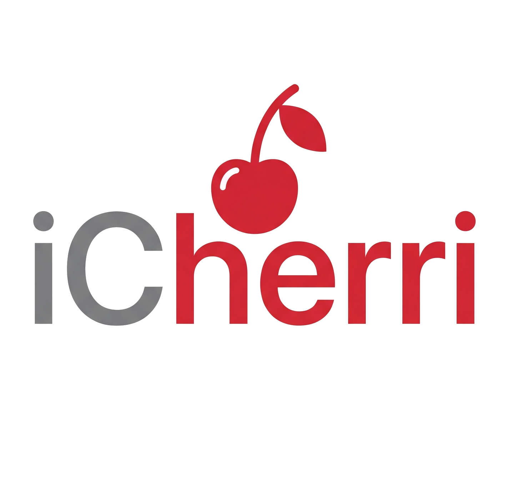

<p align="center">
  
</p>

# i-cherri

**i-cherri**는 macOS 로컬 LAN 환경에서 iPhone의 사진과 영상을 가장 안전하고 빠르고 스마트하게 백업하기 위한 솔루션입니다.  
초기 대량 백업은 유선 연결로 빠르게, 이후 일상적인 데이터는 [Cherri](https://cherrilang.org/) 기반의 iOS 단축어(Shortcuts)를 통해 증분 방식으로 자동 동기화합니다.

---

## 🍒 핵심 특징

- **초고속 초기 백업**: iPhone을 Mac에 유선 연결하여 직접 복사한 뒤 SQLite 인덱싱(`--reindex`)을 통해 즉시 동기화 상태를 맞춥니다.
- **스마트 증분 동기화**: Cherri로 작성된 iOS 단축어가 최근 3일간의 미디어를 분석, 서버와 통신하여 없는 파일만 골라 업로드합니다.
- **데이터 무결성**: SHA-256 해시 기반의 중복 체크를 통해 동일한 파일이 중복 저장되는 것을 원천 차단합니다.
- **경량 아키텍처**: Go로 작성된 단일 바이너리 서버와 SQLite를 사용하여 리소스를 최소화합니다.

---

## 🔒 보안 전제 (필독)

i-cherri는 단순함과 성능을 위해 별도의 인증 레이어를 포함하지 않습니다. 따라서 다음 보안 수칙을 반드시 준수해야 합니다.

- **로컬 LAN 전용**: 신뢰할 수 있는 집/사무실 Wi-Fi 내부에서만 사용하세요.
- **노출 금지**: 공용 인터넷, 포트 포워딩, Cloudflare Tunnel(cloudflared) 등을 통한 외부 노출은 절대 금지입니다.
- **신뢰 환경**: 공용 Wi-Fi, 학교, 카페 네트워크에서의 실행을 지양하세요.

---

## 🛠 구성 요소

- `main.go`: 고성능 Go HTTP 서버 및 인덱싱 엔진
- `iphone_daily_backup.cherri`: Cherri 기반 iOS 증분 백업 소스
- `com.local.cherri-sync.plist`: macOS 전용 launchd 자동 실행 템플릿
- `Makefile`: 빌드 및 관리를 위한 워크플로우 자동화

---

## 📋 사전 요구 사항

i-cherri를 빌드하고 실행하려면 다음 환경이 필요합니다.

- **OS**: macOS (launchd 및 iOS Shortcut 연동 최적화)
- **Go**: 1.20 버전 이상
- **Cherri CLI**: iOS 단축어 소스(`.cherri`) 컴파일 및 서명을 위해 필요 ([설치 가이드](https://cherrilang.org/language/))
- **Make**: 워크플로우 자동화를 위해 권장

---

## 🚀 시작하기

### 1. 초기 전체 백업 및 인덱싱

1. iPhone을 Mac에 유선으로 연결합니다.
2. 사진/영상을 Mac의 백업 폴더 (기본값: `~/Photos`)로 직접 복사합니다.
3. 복사된 파일들을 연월별 폴더(`YYYY-MM`)로 자동 정리합니다:
   ```bash
   # 복사한 파일들을 연월 폴더로 이동 및 정리
   python3 organize_by_month.py
   ```
   *참고: 파일은 반드시 `YYYY-MM` 폴더 구조로 정리되어야 서버가 인식합니다.*
4. 인덱스를 생성합니다:
   ```bash
   make reindex
   ```

### 2. 서버 실행

`Makefile`을 사용하여 간편하게 빌드하고 실행할 수 있습니다.

```bash
# 전체 빌드 및 실행
make all
make run
```

기본 서버 주소: `http://localhost:8787`

---

## 📱 iOS 단축어 설정

### 1. 기본 설정
1. `iPhone Daily Backup.shortcut` (signed) 파일을 iPhone으로 가져옵니다.
2. **서버 IP 설정**: 단축어 편집 모드에서 가장 상단에 있는 서버 주소 변수를 Mac의 실제 로컬 IP(예: `http://192.168.0.10:8787`)로 반드시 수정해야 합니다.

### 2. 자동화(Automation) 설정 가이드
매일 정해진 시간에 자동으로 백업되도록 설정하는 것을 권장합니다.
1. iPhone에서 **단축어** 앱을 열고 하단의 **자동화** 탭을 선택합니다.
2. 오른쪽 상단의 **+** 버튼을 눌러 새로운 자동화를 만듭니다.
3. **특정 시간**을 선택합니다 (예: 오전 3:00, 충전 중일 때 실행되도록 설정 권장).
4. 실행 조건을 **즉시 실행**으로 설정하고 '실행 시 알림'을 끕니다. (중요: 그래야 자는 동안 자동으로 진행됩니다.)
5. 다음 화면에서 **나의 단축어** 중 `iPhone Daily Backup`을 선택합니다.
6. 이제 매일 설정한 시간에 Mac으로 사진이 자동 백업됩니다.

---

## 📂 초기 백업을 위한 macOS 공유 설정

유선 연결이 번거롭다면, 같은 Wi-Fi 환경에서 **macOS 공유 폴더**를 통해 초기 대량 백업 파일을 복사할 수 있습니다.

### 1. Mac에서 공유 폴더 만들기
1. `시스템 설정` > `일반` > `공유`로 이동합니다.
2. `파일 공유`를 **켬**으로 설정하고 옆의 `i` 버튼을 누릅니다.
3. `공유 폴더` 목록 아래의 `+` 버튼을 눌러 백업 폴더(예: `~/Photos`)를 추가합니다.
4. 사용자에 대해 `읽기 및 쓰기` 권한이 있는지 확인합니다.

### 2. iPhone에서 접속하기
1. iPhone에서 **파일(Files)** 앱을 켭니다.
2. 오른쪽 상단의 `...` 버튼을 누르고 `서버에 연결`을 선택합니다.
3. Mac의 로컬 IP 주소를 입력합니다 (예: `smb://192.168.0.10`).
4. Mac 계정 아이디와 비밀번호를 입력하여 접속합니다.
5. 사진 앱에서 백업할 항목을 선택 후 `파일 앱에 저장` > Mac 공유 폴더를 선택하여 복사합니다.

---

## 📂 저장소 구조 및 DB

### 디렉토리 구조 예시
```text
~/Photos/
├── 2026-04/
├── 2026-05/
└── .iphone-backup-index.sqlite3
```

### SQLite 스키마
서버는 각 파일의 SHA-256, 원본 이름, 생성일, 크기 등을 인덱싱하여 관리합니다.

```sql
CREATE TABLE files (
  sha256 TEXT NOT NULL UNIQUE,
  original_name TEXT,
  saved_path TEXT NOT NULL,
  created_at TEXT,
  file_size INTEGER NOT NULL,
  uploaded_at TEXT NOT NULL
);
```

---

## 📋 관리 명령어 (Makefile)

- `make all`: Go 서버 및 단축어 전체 빌드
- `make go`: Go 서버 바이너리 빌드
- `make shortcut`: Signed 단축어 빌드
- `make reindex`: 사진 보관함 재인덱싱
- `make run`: 서버 재빌드 및 백그라운드 실행
- `make db-reset`: DB 초기화 및 전체 재인덱싱
- `make clean`: 빌드 결과물 삭제

---

## 🗺️ 로드맵 및 마일스톤

i-cherri의 발전을 위한 마일스톤 계획입니다.

| 마일스톤 | 대상 및 주요 기능 | 기대 효과 | 우선순위 / 난이도 | 관련 컴포넌트 |
| :--- | :--- | :--- | :---: | :--- |
| **M1: 성능 및 메타데이터** | <ul><li>`/check-batch` API 추가</li><li>서버 측 EXIF 자동 파싱</li><li>대용량 스트리밍 업로드</li></ul> | 단축어 실행 속도 획기적 개선 (10배+), 정확한 원본 촬영일 관리 | **높음** / 보통 | Go Server, Cherri Shortcut |
| **M2: 다중 기기 & 무결성** | <ul><li>기기 식별 및 분리 저장</li><li>Live Photo 이미지-비디오 매칭</li><li>Bit-rot 감지 해시 검증</li></ul> | 여러 기기 백업 혼선 방지, 라이브 포토 통합 관리, 저장 안정성 | **보통** / 보통 | Go Server, SQLite DB, Cherri |
| **M3: macOS 시스템 통합** | <ul><li>macOS Menu Bar App 개발</li><li>로컬 IP 자동 노출 기능</li><li>`launchd` 자동 설치 CLI</li></ul> | 단축어 IP 설정 편의성 개선, 서버 상태 상시 확인 및 시작/종료 관리 | **보통** / 보통 | Go Server, macOS UI (systray) |
| **M4: 웹 대시보드 & UI** | <ul><li>임베디드 대시보드 UI</li><li>미디어 타임라인 그리드 뷰</li><li>썸네일 캐싱 및 HEIC 변환</li></ul> | 미디어 보관함 시각화, 편리한 웹 브라우징, 빠른 로딩 속도 | **낮음** / 높음 | Go Server (embed), Frontend (HTML/JS) |

---

## 💬 API Reference

- `GET /health`: 서버 상태 확인
- `POST /check`: 메타데이터 기반 중복 여부 확인
- `POST /upload`: 실제 미디어 파일 업로드 (SHA-256 중복 체크 포함)

---

**i-cherri**와 함께 소중한 추억을 가장 로컬하고 안전하게 보관하세요. 🍒
