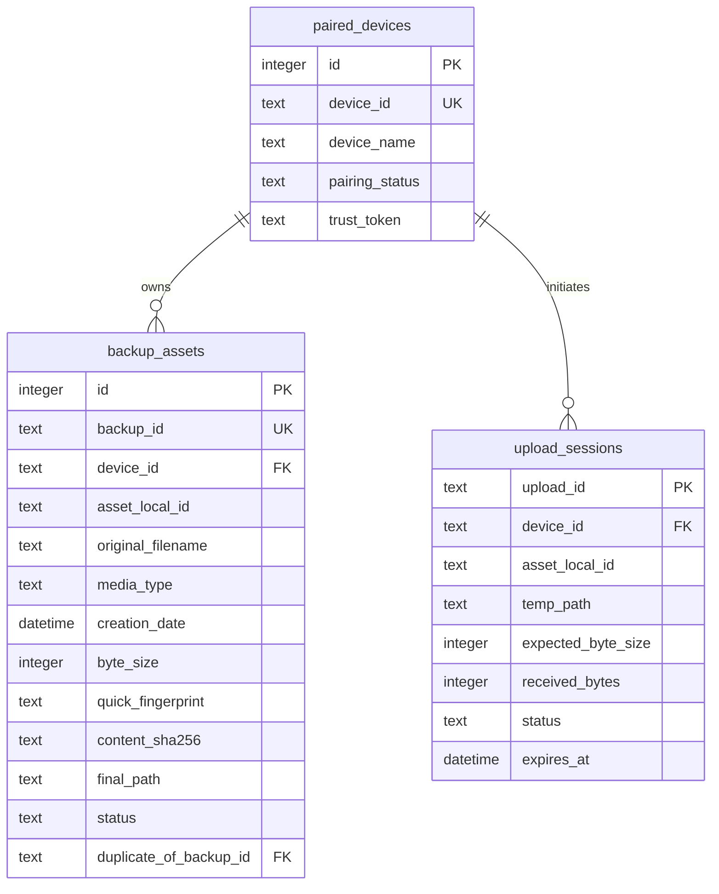

# Data Model: iCherri Swift-native Redirection

본 문서에서는 iCherri 백업 서버(macOS Receiver)의 SQLite 데이터베이스 모델과 데이터 무결성 검증을 위한 스키마 관계를 설명합니다.

---

## 1. 핵심 엔티티 및 속성 (Entities & Attributes)

### 1.1 paired_devices (페어링된 기기 정보)
- **개념**: 백업 권한을 허가받은 iOS 기기의 정보와 신뢰 토큰을 관리합니다.
- **필드 정의**:
  - `id`: INTEGER PRIMARY KEY AUTOINCREMENT (내부 식별 키)
  - `device_id`: TEXT UNIQUE NOT NULL (기기 고유 식별자 - UUID 형식)
  - `device_name`: TEXT NOT NULL (사용자가 설정한 기기명, 예: "길동의 iPhone 15 Pro")
  - `pairing_status`: TEXT NOT NULL (기기 활성화 상태: `paired`, `unpaired`)
  - `created_at`: DATETIME NOT NULL (최초 페어링 시점)
  - `last_seen_at`: DATETIME NOT NULL (최근 서버 접속 시점)
  - `trust_token`: TEXT NOT NULL (API 인증을 위해 iOS와 공유하는 비밀 키/토큰)

### 1.2 backup_assets (백업 완료 자산 기록)
- **개념**: 최종 백업 처리가 완결된 미디어 파일들의 인덱스입니다.
- **필드 정의**:
  - `id`: INTEGER PRIMARY KEY AUTOINCREMENT
  - `backup_id`: TEXT UNIQUE NOT NULL (Mac 서버가 생성하는 고유 백업 파일 식별자)
  - `device_id`: TEXT NOT NULL (기기 고유 식별자, `paired_devices` 테이블 외래키)
  - `asset_local_id`: TEXT NOT NULL (iOS 내의 PHAsset 로컬 식별자)
  - `original_filename`: TEXT NOT NULL (최초 iPhone 내 파일명)
  - `media_type`: TEXT NOT NULL (미디어 종류: `photo`, `video`, `live_photo_component`, `unknown`)
  - `creation_date`: DATETIME NOT NULL (사진/동영상 최초 촬영 시간)
  - `modification_date`: DATETIME NOT NULL (마지막 수정 시간)
  - `byte_size`: INTEGER NOT NULL (파일 바이트 크기)
  - `duration_seconds`: REAL (비디오 재생 시간, 사진의 경우 NULL)
  - `pixel_width`: INTEGER NOT NULL (가로 해상도)
  - `pixel_height`: INTEGER NOT NULL (세로 해상도)
  - `quick_fingerprint`: TEXT NOT NULL (메타데이터 핑거프린트: 촬영일+생성일+사이즈+해상도 조합 검색용 키)
  - `content_sha256`: TEXT NOT NULL (파일 콘텐츠 전체의 SHA-256 해시)
  - `final_path`: TEXT NOT NULL (최종 저장 경로, 예: `2026/05/IMG_5678.JPG`)
  - `status`: TEXT NOT NULL (자산 상태: `completed`, `duplicate`, `failed`)
  - `duplicate_of_backup_id`: TEXT (콘텐츠 해시가 동일하여 물리 저장을 건너뛴 경우, 원본의 `backup_id` 기록)
  - `first_seen_at`: DATETIME NOT NULL (처음 백업 시도 감지 시간)
  - `completed_at`: DATETIME (최종 검증 완료 및 이동 완료 시간)
  - `last_error`: TEXT (마지막 오류 메시지)
- **관계 및 제약**:
  - `(device_id, asset_local_id)` 조합은 고유(UNIQUE)해야 합니다.

### 1.3 upload_sessions (활성 업로드 세션)
- **개념**: 진행 중이거나 중단된 개별 파일의 업로드 청크 수신 임시 상태를 추적합니다.
- **필드 정의**:
  - `upload_id`: TEXT PRIMARY KEY (업로드 고유 세션 식별자 - UUID)
  - `device_id`: TEXT NOT NULL
  - `asset_local_id`: TEXT NOT NULL
  - `temp_path`: TEXT NOT NULL (서버 `incoming/` 폴더 내 임시 저장 경로)
  - `expected_byte_size`: INTEGER NOT NULL (최종 도달해야 할 전체 파일 크기)
  - `received_bytes`: INTEGER NOT NULL (현재까지 안전하게 수신된 누적 바이트)
  - `chunk_size`: INTEGER NOT NULL (클라이언트와 합의한 청크 단위 크기)
  - `status`: TEXT NOT NULL (세션 상태: `initialized`, `receiving`, `paused`, `verifying`, `completed`, `failed`)
  - `created_at`: DATETIME NOT NULL
  - `updated_at`: DATETIME NOT NULL
  - `expires_at`: DATETIME NOT NULL (세션 만료 시각 - 만료 시 incoming 임시 파일 정리 대상)
  - `last_error`: TEXT

---

## 2. 엔티티 관계도 (Entity Relationship Diagram)

---

## 3. 데이터 유효성 및 상태 전이 규칙 (Validation & Transition Rules)

1. **세션 활성화 및 갱신**:
   - 청크 수신 성공 시 `received_bytes`와 `updated_at`이 갱신되며, `expires_at`은 현재 기준 + 24시간 연장됩니다.
2. **최종 커밋(Commit) 검증**:
   - `received_bytes == expected_byte_size` 조건 충족 여부 확인.
   - 스트리밍 계산한 해시가 `expected_content_hash`와 일치하는지 확인.
   - 검증 성공 시 `upload_sessions`의 레코드는 삭제(또는 아카이브 상태로 변경)되고, `backup_assets` 테이블에 `completed` 상태의 인덱스가 추가됩니다.
