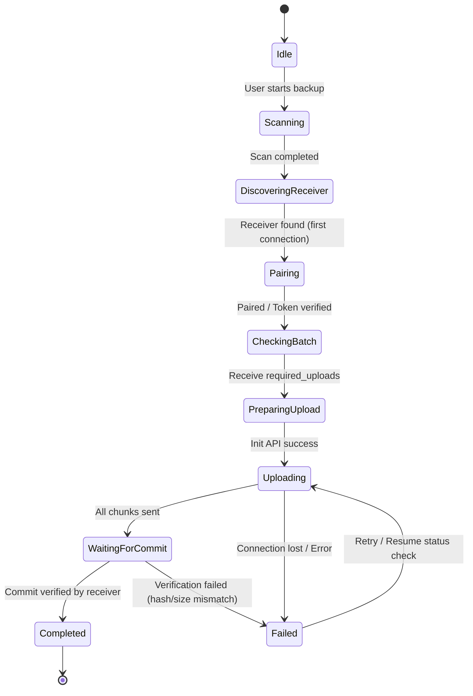

# Feature Specification: iCherri Swift-native Redirection

**Feature Branch**: `001-rewrite-to-swift`

**Created**: 2026-05-26

**Status**: Draft

**Input**: User description: "iCherri 프로젝트의 기존 방향을 완전히 재정의한다..."

---

## 1. Product Overview (제품 개요)

본 프로젝트는 iPhone의 사진 및 동영상 원본을 Mac으로 로컬 네트워크를 통해 안전하고 신속하게 백업하는 **Apple 생태계 전용 백업 솔루션**입니다. 
기존의 Shortcuts + Go server + SMB 기반 실험적 아키텍처를 완전히 폐기하고, 전체 구현을 **Swift, SwiftUI, Apple 플랫폼 네이티브 API, 그리고 Swift Package 기반의 모노레포 구조**로 전환합니다. 

초기 MVP 제품은 iOS 앱과 macOS 리시버 앱으로 구성되며, 외부 클라우드나 인터넷 연결에 의존하지 않는 안전한 로컬 단방향 증분 백업을 제공합니다.

---

## 2. Goals & Non-Goals

### Goals (제품 목표)
- **증분 백업**: 이미 백업된 사진/동영상은 다시 전송하지 않고 추가된 새로운 자산만 전송합니다.
- **중복 방지**: 물리적 및 논리적 수준의 단계별 중복 판단을 적용하여 디스크 낭비를 차단합니다.
- **무결성 검증**: 파일 전송 완료 전 크기 및 SHA-256 해시를 검증하며, 무결성이 보장된 파일만 최종 백업 디렉토리로 이동시킵니다.
- **대용량 파일 안정성**: 로컬 HTTP chunk upload 및 resumable 전송을 지원하여 네트워크 중단이나 앱 종료 상황에서도 이어서 업로드할 수 있도록 보장합니다.
- **애플 네이티브 경험**: iOS와 macOS에 최적화된 SwiftUI 인터페이스 및 백그라운드 처리 방식을 설계합니다.

### Non-Goals (비범위)
- Go receiver core, Electron, Tauri, React 스택 지원 배제
- Android, Windows, Linux 플랫폼 지원 배제
- 외부 클라우드(S3, Dropbox, iCloud 등) 연동 배제
- SMB 프로토콜 중심의 백업 전송 설계 배제
- iOS Shortcuts 기반 백업 기능 배제
- 미디어 압축, 포맷 변환(HEIC -> JPG 등), AI 분석 기능 배제
- 인터넷망을 통한 원격 백업 배제 (오직 신뢰하는 로컬 LAN 환경만 지원)

---

## 3. User Scenarios & Testing

### User Story 1 - 최초 백업 및 증분 백업 (Priority: P1) - MVP
사용자가 처음 iOS 앱을 켜고 Mac 리시버와 페어링한 뒤 모든 사진/영상을 안전하게 백업하고, 이후 실행 시 추가된 미디어만 신속히 전송한다.
- **Why this priority**: 서비스 가동을 위한 핵심 최소 기능 제품(MVP) 동작을 위한 근간 경로입니다.
- **Independent Test**: 페어링 후 첫 백업을 실행하고, 신규 미디어를 추가해 두 번째 백업을 수행해 증분 업로드만 정상 처리되는지 검증합니다.
- **Acceptance Scenarios**:
  1. **Given** iOS 앱과 Mac 리시버가 성공적으로 페어링된 상태에서, **When** 백업을 시작하면, **Then** 전체 자산이 스캔되고 필요한 파일이 모두 Mac의 `incoming/`을 거쳐 최종 `YYYY/MM/` 폴더로 무결성 검증을 거쳐 이동 완료된다.
  2. **Given** 이전 백업이 성공적으로 수행된 후 새 사진 2장이 추가된 상태에서, **When** 백업을 다시 시작하면, **Then** 기존 사진 100장은 스킵되고 새로 추가된 2장만 업로드 완료된다.

### User Story 2 - 단계별 중복 방지 (Priority: P1)
동일한 미디어가 중복 전송되어 물리적인 디스크 공간이 낭비되거나 최종 폴더에 중복 파일이 생기지 않도록 단계별 중복 제거 필터를 적용한다.
- **Why this priority**: 로컬 백업 스토리지의 디스크 공간 효율성과 파일 무결성을 지키기 위해 필수적입니다.
- **Independent Test**: 파일명은 다르지만 내용(SHA-256)이 완전히 일치하는 사진들을 전송하여 물리 파일이 중복으로 써지지 않음을 테스트합니다.
- **Acceptance Scenarios**:
  1. **Given** 파일명과 경로는 다르지만 동일한 SHA-256 해시를 가진 자산이 이미 백업되어 있을 때, **When** 백업을 실행하면, **Then** Mac 리시버는 물리 파일을 저장하지 않고 DB 상에 해당 자산 매핑 정보(`duplicate`)만 등록한다.

### User Story 3 - 대용량 파일 안정성 및 Resumable Chunk Upload (Priority: P2)
수백 MB 또는 GB 단위의 대용량 동영상 업로드 시 메모리 크래시(OOM)를 예방하고, 전송 단절 시 마지막 성공 청크 이후부터 이어받기를 지원한다.
- **Why this priority**: 모바일 무선 통신 환경의 불완전성을 극복하고 대용량 동영상의 OOM 크래시를 방지하기 위해 필수적입니다.
- **Independent Test**: 대용량 비디오 청크 전송 중 연결을 차단한 뒤 재시도할 때 이전에 수신 성공한 오프셋 다음 청크부터 재개되는지 검증합니다.
- **Acceptance Scenarios**:
  1. **Given** 500MB 비디오를 청크 단위로 업로드하던 중 200MB 위치에서 연결이 끊기면, **When** 재연결 후 백업을 수행할 때, **Then** 201MB 위치부터 청크 업로드가 재개되어 최종 검증 완료된다.

### User Story 4 - 백업 요약 표시 및 GUI (Priority: P2)
백업 과정의 흐름을 부드러운 프로그레스 바(pbar) 및 상태 텍스트로 조회하고, 완료 후 성공, 중복 건너뜀, 실패 건수의 상세 통계를 확인한다.
- **Why this priority**: 사용자에게 직관적이고 안전한 사용자 경험을 제공하여 백업 완료 상태를 신뢰할 수 있도록 돕습니다.
- **Independent Test**: 백업 실행 시 프로그레스 바가 부드럽게 채워지며, 완료 시 결과 통계 팝업이 가이드라인 비주얼에 맞게 출력되는지 검사합니다.
- **Acceptance Scenarios**:
  1. **Given** 백업 프로세스가 완료되면, **When** 결과 대시보드가 로드될 때, **Then** 성공, 중복, 실패 건수가 정확한 수치로 시각화되어 표시된다.

---

## 4. Architecture Constraints (아키텍처 제약)

### 모노레포 구조 (Monorepo Layout)
```
icherri/
  iCherri.xcworkspace

  apps/
    ios/
      iCherri-iOS/
        App/
        Features/
          Onboarding/
          Backup/
          Pairing/
          Settings/
          FailedItems/
          Diagnostics/
        Platform/
          Photos/
          Upload/
          LocalNetwork/
          BackgroundTasks/
          Keychain/

    mac/
      iCherri-Mac/
        App/
        Features/
          MenuBar/
          ReceiverDashboard/
          Pairing/
          Settings/
          Logs/
          FailedUploads/
          PairedDevices/
        Platform/
          ReceiverServer/
          Storage/
          FileAccess/
          LocalNetwork/
          LaunchAtLogin/
          Keychain/

  packages/
    ICherriProtocol/
    ICherriCore/
    ICherriDesignSystem/
    ICherriPreviewSupport/

  docs/
    architecture.md
    protocol.md
    backup-state-machine.md
    storage-layout.md
    integrity-model.md
    local-network-and-pairing.md
```

### Shared Swift Packages의 역할 및 경계
- **ICherriProtocol**: DTO(Codable, Sendable) 정의. request/response 데이터 계약, 에러 코드, 프로토콜 버전 명세가 포함되며 UI, SQLite, Photos.framework에 의존하지 않음.
- **ICherriCore**: 순수 비즈니스 로직 담당. 백업 상태 머신, 중복 제거 규칙(Deduplication Policy), 메타데이터 핑거프린트 생성 규칙, 파일명 충돌 정책, 무결성 검증 추상 규칙 포함. 플랫폼 API 의존성 없음.
- **ICherriDesignSystem**: 공통 UI 컴포넌트(상태 배지, 진행률 카드, 버튼, 에러 배너 등) 및 디자인 토큰 정의. SwiftUI 기반으로 작성하되 플랫폼 특화 레이아웃은 배제.
- **ICherriPreviewSupport**: SwiftUI Preview 및 유닛 테스트용 Mock 데이터와 Mock 서비스 프로바이더 제공.

---

## 5. Functional Requirements (기능적 요구사항)

### iOS App
- **FR-IOS-001**: Photos.framework를 활용하여 사진 및 동영상 자산을 스캔하고, 전체 접근 및 제한 접근 상태를 판별하여 대응해야 함.
- **FR-IOS-002**: Bonjour 및 Network.framework를 이용해 로컬 네트워크의 Mac 리시버를 자동으로 탐색해야 하며, 탐색 실패 시 수동 IP/Host 입력을 허용해야 함.
- **FR-IOS-003**: Mac 리시버와의 최초 1회 인증(페어링) 절차를 거치며, 획득한 인증 토큰을 iOS Keychain에 안전하게 보존해야 함.
- **FR-IOS-004**: 백업 대상 스캔 후 Mac 리시버의 `/backup/check-batch` API를 호출하여 백업이 필요한 자산(required_uploads) 목록만 식별해야 함.
- **FR-IOS-005**: 100MB 초과 대용량 파일을 포함한 모든 필요한 파일은 Resumable HTTP Chunk Upload 방식을 사용하여 청크 단위로 업로드해야 함.
- **FR-IOS-006**: iOS 백그라운드 제한 정책을 고려하여 MVP 수준에서는 안정적인 전면(Foreground) 수동 실행 백업을 최우선으로 최적화함.

### macOS Receiver App
- **FR-MAC-001**: 메뉴바 앱(Menu Bar Extra) 형태로 백그라운드에서 동작하며, 필요 시 대시보드 및 설정 윈도우를 호출할 수 있어야 함.
- **FR-MAC-002**: 로컬 네트워크에서 iOS 기기의 접근을 수신하는 로컬 HTTP 서버 및 페어링 확인 기능을 구동해야 함.
- **FR-MAC-003**: 사용자가 미디어 자산이 백업될 최종 디렉토리를 임의 선택할 수 있도록 지원해야 함.
- **FR-MAC-004**: SQLite 데이터베이스(GRDB.swift 등 사용 권장)를 운용하여 기기 목록, 백업 완료 자산 인덱스, 업로드 세션 정보를 보존해야 함.
- **FR-MAC-005**: 수신 중인 청크 조각들은 `incoming/` 임시 폴더에 관리하고, iOS의 Commit 요청이 오면 파일 크기와 SHA-256 해시를 검증해야 함.
- **FR-MAC-006**: 중복 제거(dedupe) 판정 후 최종 검증에 성공하면 `incoming/`에서 최종 저장 디렉토리로 atomic move 처리를 해야 함.

---

## 6. Data Contracts (데이터 계약)

### DTO 및 모델 정의 (Codable)

```swift
public struct ProtocolVersion: Codable, Sendable {
    public let major: Int
    public let minor: Int
    
    public func isCompatible(with other: ProtocolVersion) -> Bool {
        return self.major == other.major
    }
}

public struct DeviceIdentity: Codable, Sendable {
    public let deviceID: String
    public let deviceName: String
    public let platform: String
    public let appVersion: String
    public let protocolVersion: ProtocolVersion
}

public struct ReceiverInfo: Codable, Sendable {
    public let receiverID: String
    public let receiverName: String
    public let platform: String
    public let appVersion: String
    public let protocolVersion: ProtocolVersion
    public let status: String
    public let availableFeatures: [String]
}

public struct BackupAssetCandidate: Codable, Sendable {
    public let deviceID: String
    public let assetLocalID: String
    public let originalFilename: String
    public let mediaType: MediaType
    public let creationDate: Date
    public let modificationDate: Date
    public let byteSize: Int64?
    public let durationSeconds: Double?
    public let pixelWidth: Int
    public let pixelHeight: Int
    public let uti: String?
    public let quickFingerprint: String
    public let contentHash: String? // Optional pre-computed hash
}

public enum MediaType: String, Codable, Sendable {
    case photo
    case video
    case livePhotoComponent
    case unknown
}

public struct CheckBatchRequest: Codable, Sendable {
    public let protocolVersion: ProtocolVersion
    public let device: DeviceIdentity
    public let candidates: [BackupAssetCandidate]
}

public struct CheckBatchResponse: Codable, Sendable {
    public let requiredUploads: [RequiredUpload]
    public let alreadyBackedUp: [AlreadyBackedUp]
    public let duplicates: [DuplicateAsset]
    public let unsupported: [UnsupportedAsset]
}

public struct RequiredUpload: Codable, Sendable {
    public let assetLocalID: String
    public let uploadReason: UploadReason
    public let uploadMode: UploadMode
    public let preferredChunkSize: Int
}

public enum UploadReason: String, Codable, Sendable {
    case notFound
    case previousFailed
    case metadataMismatch
    case hashMissing
    case hashMismatch
    case receiverRequest
}

public enum UploadMode: String, Codable, Sendable {
    case resumableHTTPChunked
}

public struct AlreadyBackedUp: Codable, Sendable {
    public let assetLocalID: String
    public let existingBackupID: String
    public let completedAt: Date
    public let contentHash: String?
}

public struct DuplicateAsset: Codable, Sendable {
    public let assetLocalID: String
    public let duplicateOfBackupID: String
    public let reason: DuplicateReason
}

public enum DuplicateReason: String, Codable, Sendable {
    case sameAssetID
    case sameContentHash
    case sameMetadataFingerprint
}

public struct UnsupportedAsset: Codable, Sendable {
    public let assetLocalID: String
    public let reason: UnsupportedReason
}

public enum UnsupportedReason: String, Codable, Sendable {
    case unsupportedMediaType
    case inaccessibleAsset
    case missingOriginal
    case permissionDenied
    case receiverIncompatible
    case tooLarge
}

public struct UploadInitRequest: Codable, Sendable {
    public let protocolVersion: ProtocolVersion
    public let device: DeviceIdentity
    public let asset: BackupAssetCandidate
    public let filename: String
    public let expectedByteSize: Int64
    public let expectedContentHash: String?
    public let requestedChunkSize: Int
    public let resumeToken: String?
}

public struct UploadInitResponse: Codable, Sendable {
    public let uploadID: String
    public let accepted: Bool
    public let chunkSize: Int
    public let receivedBytes: Int64
    public let expiresAt: Date
    public let rejectReason: String?
}

public struct UploadStatusResponse: Codable, Sendable {
    public let uploadID: String
    public let status: String
    public let receivedBytes: Int64
    public let expiresAt: Date
    public let lastError: String?
}

public struct CommitUploadRequest: Codable, Sendable {
    public let protocolVersion: ProtocolVersion
    public let uploadID: String
    public let assetLocalID: String
    public let finalByteSize: Int64
    public let finalContentHash: String?
    public let clientFinishedAt: Date
}

public struct CommitUploadResponse: Codable, Sendable {
    public let status: CommitStatus
    public let backupID: String?
    public let duplicateOfBackupID: String?
    public let displayPath: String?
    public let errorCode: BackupErrorCode?
    public let message: String?
}

public enum CommitStatus: String, Codable, Sendable {
    case completed
    case duplicate
    case checksumMismatch
    case sizeMismatch
    case rejected
    case failed
}

public enum BackupErrorCode: String, Codable, Sendable {
    case unsupportedProtocolVersion = "UNSUPPORTED_PROTOCOL_VERSION"
    case unauthorizedDevice = "UNAUTHORIZED_DEVICE"
    case receiverNotPaired = "RECEIVER_NOT_PAIRED"
    case invalidAssetMetadata = "INVALID_ASSET_METADATA"
    case uploadSessionNotFound = "UPLOAD_SESSION_NOT_FOUND"
    case uploadSessionExpired = "UPLOAD_SESSION_EXPIRED"
    case chunkOutOfRange = "CHUNK_OUT_OF_RANGE"
    case checksumMismatch = "CHECKSUM_MISMATCH"
    case sizeMismatch = "SIZE_MISMATCH"
    case insufficientDiskSpace = "INSUFFICIENT_DISK_SPACE"
    case fileWriteFailed = "FILE_WRITE_FAILED"
    case duplicateContent = "DUPLICATE_CONTENT"
    case permissionDenied = "PERMISSION_DENIED"
    case unknownError = "UNKNOWN_ERROR"
}
```

---

## 7. State Machines & Transitions



### 상태 정의

#### iOS BackupRunState
- `idle`: 대기 상태.
- `requestingPermission`: Photos 권한 승인 대기.
- `scanning`: Photos 앨범 탐색 및 자산 인덱싱 중.
- `discoveringReceiver`: Bonjour 네트워크 내 Mac 리시버 탐색 중.
- `pairing`: 페어링 키 입력 및 승인 대기 중.
- `checkingBatch`: `/backup/check-batch` API를 통한 백업 대상 확인 중.
- `preparingUpload`: 개별 자산의 업로드 세션 초기화 중.
- `uploading`: 청크 데이터 전송 중.
- `waitingForCommit`: 전송이 완료되어 서버의 Verification 대기 중.
- `completed`: 무결성 검증 완료 및 최종 백업 완료.
- `completedWithWarnings`: 일부 에러가 있었으나 전체 프로세스는 정상 완료.
- `failed`: 프로세스 오류 또는 네트워크 차단으로 중단됨.
- `cancelled`: 사용자가 수동 취소함.

#### Mac ReceiverState
- `stopped`: 서버 정지 상태.
- `starting`: 서버 포트 바인딩 중.
- `running`: 대기 및 수신 가능 상태.
- `pairingRequired`: 미승인 기기의 페어링 요청이 인입되어 사용자 수락을 대기 중.
- `receiving`: 미디어 업로드 처리 중.
- `verifying`: 임시 파일의 크기 및 SHA-256 스트리밍 해시 검증 중.
- `lowDiskSpace`: 디스크 여유 공간 부족 경고 상태.
- `error`: 네트워크 포트 충돌 등의 구동 에러.

#### UploadSessionState (Mac)
- `initialized`: 세션 생성됨.
- `receiving`: 청크 수신 중.
- `paused`: 일시 정지(네트워크 단절 등).
- `uploadedTemp`: 모든 조각이 수신되어 임시 폴더에 대기 중.
- `verifying`: 해시 검증 중.
- `completed`: 영구 저장 및 인덱스 등록 성공.
- `duplicate`: 중복 파일 처리 완료 (물리 이동 취소, 메타 레코드만 생성).
- `failed`: 검증 실패 혹은 시스템 실패.
- `expired`: 세션 유효시간 만료.
- `cancelled`: 취소 처리됨.

---

## 8. Storage Model (저장소 모델)

Mac 리시버는 백업의 **Source of Truth**로서 데이터베이스 및 물리 파일 시스템 구조를 정형화하여 관리합니다.

### SQLite DB Schema (GRDB.swift 등 활용 권장)

#### Table: `paired_devices`
```sql
CREATE TABLE paired_devices (
    id INTEGER PRIMARY KEY AUTOINCREMENT,
    device_id TEXT UNIQUE NOT NULL,
    device_name TEXT NOT NULL,
    pairing_status TEXT NOT NULL, -- 'paired', 'unpaired'
    created_at DATETIME NOT NULL,
    last_seen_at DATETIME NOT NULL,
    trust_token TEXT NOT NULL
);
```

#### Table: `backup_assets`
```sql
CREATE TABLE backup_assets (
    id INTEGER PRIMARY KEY AUTOINCREMENT,
    backup_id TEXT UNIQUE NOT NULL, -- UUID generated by Mac
    device_id TEXT NOT NULL,
    asset_local_id TEXT NOT NULL,
    original_filename TEXT NOT NULL,
    media_type TEXT NOT NULL,
    creation_date DATETIME NOT NULL,
    modification_date DATETIME NOT NULL,
    byte_size INTEGER NOT NULL,
    duration_seconds REAL,
    pixel_width INTEGER NOT NULL,
    pixel_height INTEGER NOT NULL,
    quick_fingerprint TEXT NOT NULL,
    content_sha256 TEXT NOT NULL,
    final_path TEXT NOT NULL,
    status TEXT NOT NULL, -- 'completed', 'duplicate', 'failed'
    duplicate_of_backup_id TEXT,
    first_seen_at DATETIME NOT NULL,
    completed_at DATETIME,
    last_error TEXT,
    FOREIGN KEY(device_id) REFERENCES paired_devices(device_id),
    UNIQUE(device_id, asset_local_id)
);
```

#### Table: `upload_sessions`
```sql
CREATE TABLE upload_sessions (
    upload_id TEXT PRIMARY KEY,
    device_id TEXT NOT NULL,
    asset_local_id TEXT NOT NULL,
    temp_path TEXT NOT NULL,
    expected_byte_size INTEGER NOT NULL,
    received_bytes INTEGER NOT NULL,
    chunk_size INTEGER NOT NULL,
    status TEXT NOT NULL, -- 'initialized', 'receiving', 'paused', 'verifying', 'completed', 'failed'
    created_at DATETIME NOT NULL,
    updated_at DATETIME NOT NULL,
    expires_at DATETIME NOT NULL,
    last_error TEXT
);
```

#### Table: `backup_runs`
```sql
CREATE TABLE backup_runs (
    id INTEGER PRIMARY KEY AUTOINCREMENT,
    device_id TEXT NOT NULL,
    started_at DATETIME NOT NULL,
    completed_at DATETIME,
    scanned_count INTEGER NOT NULL,
    required_upload_count INTEGER NOT NULL,
    uploaded_count INTEGER NOT NULL,
    skipped_count INTEGER NOT NULL,
    duplicate_count INTEGER NOT NULL,
    failed_count INTEGER NOT NULL,
    status TEXT NOT NULL
);
```

#### Table: `receiver_logs`
```sql
CREATE TABLE receiver_logs (
    id INTEGER PRIMARY KEY AUTOINCREMENT,
    timestamp DATETIME NOT NULL,
    level TEXT NOT NULL, -- 'info', 'warn', 'error'
    category TEXT NOT NULL,
    message TEXT NOT NULL,
    related_upload_id TEXT,
    related_asset_id TEXT
);
```

### Directory Structure (저장 디렉토리 구조)
```
backup_root/
  .icherri/
    incoming/    <- 임시 수신 조각들이 머무는 곳 (파일명: upload_id 기반)
    db/          <- SQLite DB 파일 보관 (.icherri.sqlite3)
    logs/        <- 텍스트 형태 진단 로그 보관
  YYYY/
    MM/
      original_files
```

### Storage Rules (저장소 무결성 규칙)
1. **Atomic Move**: `incoming/` 내 임시 파일은 검증이 완벽히 끝난 직후에만 `YYYY/MM/` 폴더로 이동합니다. 이동 시 에러가 나면 트랜잭션을 롤백하고 임시 파일 영역의 상태를 복구합니다.
2. **Deterministic Filename Conflict Resolution**: 만약 동일 연/월 폴더에 이미 동일 파일명이 존재하지만 SHA-256 내용이 다를 경우, 파일명 뒤에 타임스탬프 또는 순차 구분자(예: `IMG_1234_1.JPG`)를 덧붙여 덮어쓰기를 원천 방지합니다.
3. **Incoming Cleanup**: 만료되거나 중단된 후 재개되지 않는 임시 파일(`upload_sessions` 상 `expires_at` 초과)은 디스크 절약을 위해 macOS 리시버에서 주기적으로 자동 삭제 기능을 제공해야 합니다.

---

## 9. Network & Pairing Model (네트워크 및 페어링)

- **Local Network Only**: 로컬 서브넷 환경(Wi-Fi, Wired LAN) 내 통신만을 제공하며 외부 프록시나 외부 서버 터널링은 지원하지 않습니다.
- **Bonjour Discovery**: macOS 리시버는 Bonjour를 사용하여 로컬 네트워크에 서비스 인스턴스를 광고합니다. iOS 앱은 Bonjour 검색 모듈을 활성화해 리시버 서비스를 탐색합니다.
- **Pairing & Trust Architecture**:
  1. 기기 발견 후 연결을 시작하면 macOS 대시보드에서 1회용 난수 코드(또는 QR 코드)를 표시합니다.
  2. iOS에 이를 입력하여 인증을 마치면, 리시버와 클라이언트는 서로 고유 식별자 및 페어링 토큰을 교환합니다.
  3. 교환한 보안 토큰은 각각 Apple의 Keychain Services API를 사용해 안전한 영역에 적재합니다.
  4. 이후 모든 API 요청 시 HTTP Header 또는 Payload에 페어링 토큰 검증 정보를 포함해야 합니다.

---

## 10. Integrity & Deduplication Model (무결성 및 중복제거)

### 무결성 검증 (Integrity Verification)
- **Streaming SHA-256**: 전송받은 파일 조각들을 결합하거나 최종 검증할 때, **전체 파일을 메모리에 로드하지 않는 스트리밍 SHA-256 연산**을 구현해야 합니다. 대용량 동영상 백업 시 메모리 부족(OOM)으로 인한 macOS 리시버 크래시를 방지하기 위함입니다.
- **Double Check**: `/uploads/{uploadId}/commit` 호출 시, Mac 리시버는 실제 물리 디스크에 수신 완료된 임시 파일의 실제 바이트 크기와 SHA-256 값을 데이터베이스 상의 기대 데이터와 엄격하게 상호 검증해야 합니다.

### 중복제거 판단 단계 (Deduplication Policy)
중복 판단은 아래의 순서대로 단계별로 수행합니다:
1. **1단계**: 기기 ID 및 자산의 로컬 식별자 (`device_id` + `asset_local_id`) 매칭. 이미 성공적으로 기록된 매핑이 DB에 존재하면 스킵합니다.
2. **2단계**: 메타데이터 핑거프린트(`quick_fingerprint`: 촬영일 + 생성일 + 파일크기 + 해상도 조합 문자열) 매칭. DB 인덱스를 검색해 후보를 찾습니다.
3. **3단계**: 실제 파일의 SHA-256 콘텐츠 해시 검증. 
   - 만약 DB에 정확히 일치하는 SHA-256 해시가 존재하면 물리적인 중복 파일을 보관하지 않습니다.
   - 대신 해당 자산 레코드(`backup_assets`)를 새롭게 인서트하되, `status`를 `duplicate`로 마킹하고 기존 백업 레코드의 ID를 `duplicate_of_backup_id` 필드에 연결합니다.

---

## 11. UX Requirements (사용자 경험 요구사항)

### iOS App UI
1. **Onboarding / Pairing Screen**: 
   - 앱 접근 권한(사진첩 전체/제한 권한) 가이드 제공.
   - 로컬 영역 내의 Mac 리시버 목록 자동 노출. 
   - 연결 시 macOS 화면의 일회용 코드 입력 창 노출.
2. **Backup Dashboard**:
   - 페어링된 Mac 상태(연결 여부, 디스크 남은 공간 등) 표시.
   - 스캔된 총 자산 수, 백업이 필요한 자산 수(required_uploads), 생략 가능한 자산 수 구분 표시.
   - 백업 시작/일시정지 버튼 배치.
3. **Backup Progress View**:
   - 현재 단계(스캔 중, 청크 업로드 중, 검증 대기 중 등)를 명확한 텍스트와 게이지 바 애니메이션으로 제공.
   - 업로드 실패 자산 발생 시 직관적인 에러 카드 형태로 리스트업하고 재시도 옵션을 보여줌.
4. **Settings Screen**:
   - 페어링 장치 해제, 사진첩 권한 재요청 가이드, 수동 IP 강제 연결 필드 제공.

### macOS App UI (MenuBar & Dashboard)
1. **Menu Bar Menu**:
   - 수신 서버 구동 상태 표시 (Running / Stopped).
   - 최근 성공적으로 수행된 백업 시간 표시.
   - 대시보드 윈도우 즉시 열기 단축 링크.
2. **Dashboard Main View**:
   - 현재 페어링되어 권한을 얻은 iOS 장치들의 리스트 표시.
   - 디스크 용량 모니터링 그래프 정보 및 경고 상태 표시.
   - 현재 진행 중인 액티브 업로드 세션의 실시간 진행률 리스트 표시.
3. **Failed List & Logs**:
   - 최근 무결성 오류 등으로 실패한 트랜잭션 내역 및 임시 파일 정리(Incoming Cleanup) 기능 제공.
   - 발생한 상세 에러 로그의 뷰어 제공 및 디버깅용 내보내기(.zip) 기능 제공.

### 디자인 가이드라인 (iOS 26 & macOS Tahoe 최적화)
1. **Glassmorphism 및 Liquid Glass 아키텍처**:
   - macOS 26 (Tahoe) 및 iOS 26의 새로운 비주얼 언어인 **Liquid Glass(리퀴드 글래스)** 및 **Glassmorphism(글래스모피즘)** 디자인 언어를 타겟팅합니다.
   - SwiftUI의 재질 시스템(`.ultraThinMaterial`, `.thinMaterial`)을 적극 활용하여 흐림 효과(Blur)와 반투명 효과가 적용된 투명감 있는 UI를 구성합니다.
   - 공간감 있는 입체적 레이아웃(Spatial Depth), 부드러운 그라데이션 광택(Gradient Sheen), 그리고 미세 모션 효과(Micro-animations)를 주어 프리미엄 앱 수준의 시각적 완성도를 달성합니다.
2. **반응형 마이크로 인터랙션**:
   - 청크 전송 시의 속도 및 진행 게이지 바(pbar)가 튀지 않고 스무스하게 렌더링되도록 SwiftUI 스프링 애니메이션 및 프레임 레이트 스케줄링을 조율합니다.
   - 햅틱 피드백(Haptic Feedback) 및 상태 변화 알림음을 연동하여 직관적인 피드백을 제공합니다.

---

## 12. Testing Requirements (테스트 요구사항)

- **DTO Serialization Tests**: `ICherriProtocol` 패키지 내 모든 DTO의 JSON 인코딩 및 디코딩 호환성을 보장하는 테스트.
- **Protocol Compatibility Tests**: 프로토콜 major/minor 버전에 대한 클라이언트-서버 통신 호환 판단 테스트.
- **State Machine Integration Tests**: `BackupRunState` 및 `UploadSessionState` 상의 복잡한 비정상 전이 예방 테스트.
- **Streaming SHA-256 Tests**: 1GB 이상의 임시 비디오 파일을 가상으로 스트리밍 공급하면서 메모리 점유율을 모니터링하여 OOM이 발생하지 않음을 증명하는 테스트.
- **Deduplication Logic Tests**: 1단계(자산 ID), 2단계(메타데이터), 3단계(해시) 중복 판정 모듈 테스트.
- **Commit Idempotency Tests**: 완료된 업로드에 대해 중복 커밋(Commit) API가 들어와도 DB 에러나 중복 파일 처리가 발생하지 않는지 검증하는 테스트.
- **Temporary File Cleanup Tests**: 유효 시간 초과 파일 삭제 스케줄러 기능 검증 테스트.

---

## 13. Risks and Open Questions (위험 요소 및 열린 질문)

> [!WARNING]
> 아래는 개발 착수 전 신중히 고려하거나 합의해야 할 위험성 및 쟁점 요소들입니다.

### 1. iOS 백그라운드 태스크 제약 (Background Task Constraints)
- **위험 요소**: iOS는 앱이 백그라운드로 전환되면 네트워크 소켓 전송을 수 분 내로 강제 차단하거나 중단시킵니다. `BGProcessingTask`나 `URLSessionConfiguration.background`를 활용해도 OS 스케줄러의 제약에 따라 청크 전송 보장이 어렵습니다.
- **해결책/방향성**: 초기 MVP 버전에서는 백업 수행 시 앱을 활성화 상태로 유지하도록 화면 꺼짐 방지(Idle Timer Disabled) 기능을 유도하고, 백그라운드 백업은 과장하여 광고하지 않고 포그라운드 백업 중심의 사용성을 유도합니다.

### 2. Bonjour Discovery의 네트워크 의존성
- **위험 요소**: 멀티캐스트 DNS(mDNS) 기반의 Bonjour 탐색은 가정용 공유기의 무선 분리 옵션(AP Isolation)이나 로컬 네트워크 보안 정책에 의해 차단될 우려가 큽니다.
- **해결책/방향성**: 수동 IP 검색 및 페어링 연결 기능을 필수 Fallback으로 설계해야 하며, iOS 앱의 수동 셋업 화면에 관련 가이드를 친절히 배치해야 합니다.

### 3. Apple Sandbox 외부의 볼륨 쓰기 권한
- **위험 요소**: macOS 앱이 App Sandbox 상태인 경우 사용자가 지정한 임의 백업 폴더(예: 외장 하드 드라이브 등)에 파일을 atomic move할 때 Sandbox 권한 범위 바깥으로 파일 쓰기 권한이 거부될 수 있습니다.
- **해결책/방향성**: macOS 리시버에서 `NSOpenPanel`을 통해 사용자가 루트 백업 디렉토리를 승인하도록 유도하고, 복원 가능한 파일 북마크(Security-scoped bookmark)를 DB나 UserPreferences에 저장하여 재부팅 시에도 권한을 유지하도록 합니다.
